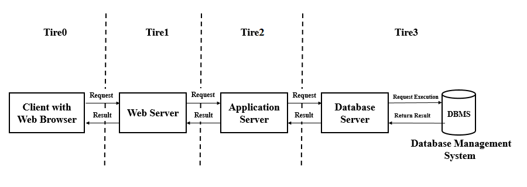

# SRE intro
## User journey
- The set of steps that a user must take to complete a task
### User experience
- How statisfied the user is after carrying out the user journey
#### Cloud computing with AWS
##### AWS services  
- Creating github repo to push the markdown
- Amazon Web Services (AWS)
### What is an SRE

- Improve existing systems' reliability 
- Focused on user journey, internal and external
- Ensure new features are implemented without negative impacts
---
### Benefits of Cloud Computing

#### Ease of use 
- AWS management console user friendly interface
- Extensive and available API documentation
#### Flexibility
- Not service dependant 
- Operating system, programming language, web application platform, database etc.  
#### Robustness 
- 84 availability zones and 26 regions AWS
- Minimum of 2 availability zones per region usually with 100km
- Auto scaling, traffic automatically redirected in case of poor zone availability or zone health
#### Cost Effective
- Only pay for the reasources used
- No long-term contract/commitments

---

#### AWS Infrastructure

- Amazon has 26 regions 
- North America, South America, Europe, China, Asia Pacific, South Africa, and the Middle East

#### Content Delivery Network (CDN)
- Caches static content
- Reduce the load on the origin 

#### On Premises vs Hybrid
- Security differences 
- Cost differences
- Liability for data


#### Diagram


#### Set up EC2
- navigate to ec2 tab
- select "launch instance"
- select os
- select t2 micro instance type
- select DevOpsStudent default 1a subnet
- select enable for auto-assign public ip
- keep storage default 8gb
- add tags for name
- add existing security group or create a new one
- make sure port 22 and port 80 allowed
- review the details
- launch and select 105|RSA key pair

#### linux commands
- check service status `systemctl status <service_name>`
- start service `sudo systemctl start <service_name>`
- stop service `sudo systemctl stop <service_name>`
- enable service `systemctl enable <service_name>`
- install package `sudo apt install <package_name> -y`
- remove package `sudo apt remove <package_name> -y` 
- view all process `top` 
- who am I `uname` or `uname -a`
- where am I `pwd` 
- create a directory `mkdir <name>`
- how to check dir `ls` or `ls -a` 
- how to create a file `touch <name>`
- move a file `mv <file_path> <location__path>`
- delete `sudo rm -rf <name>`
- view file contents `cat <name>`

#### file permisions
- check permisions `ll`
- change file permision `chmod permision file_name`
- write `w` 
- read `r`
- exe `x`
- https://chmod-calculator.com

#### Bash scripting
```bash
#!/bin/bash

# run updates
sudo apt-get update -y

# run upgrades
sudo apt-get upgrade -y

# install nginx
sudo apt-get install nginx -y

# start nginx
sudo systemctl start nginx

# enable nginx
sudo systemctl enable nginx
```

- change the file to exe `chmod +x provision.sh`
- how to run `./provision.sh`

#### Install tomcat
```bash
#!/bin/bash

# install tomcat
sudo apt install tomcat9 -y

# start tomcat
sudo systemctl start tomcat9

# enable tomcat
  sudo systemctl enable tomcat9

# allow port 8080 traffic - tomcat default
sudo ufw allow from any to any port 8080 proto tcp
```
- make sure to set the script as executable
- make sure to add inbound rule to security group for port 8080

#### Virtual Private Cloud (VPC)
- Own private data centre
- Hosted on the public AWS cloud
- A place where the instances are hosted for sparta

#### Internet gateway
- part of the vpc
- connection between the vpc and the internet 

#### Route tables 
- Contain a set of rules
- Determine where and how network traffic from subnet is directed  

#### Subnet
- segmented piece of the vpc network
- more efficient 
- minimize traffic

#### Nacls
- network access controller 
- enforces a security policy onto devices that access the network
- security and management

#### Security Group
- virtual firewall
- set of security rules for inbound and outbound traffic 

#### Secure app on public cloud
- Add rules to security group
- Restrict access

#### default outbound rules
- Allow all traffic by default


#### linux kill command
https://phoenixnap.com/kb/how-to-kill-a-process-in-linux

```bash
killall <process>

# or 

kill <processID>

# if unresponsive 

kill -9 <processID>
```
<<<<<<< HEAD

#### Monolith Architechture 

- simple but has limitatios and complexity 
- heavy apps can slow down the start up time
- each update results into redeploying the full stack app
- fruitful for simple and lightweight apps
- not ideal for scalable infrastructure
- used where there is a set expectation which will not increase in the future
- e.g. barber shop, school

#### N Tier Architechture & Two Tier Architecture 

- separate responsibility of the program
- each layer holds its own seperate responsibility 
- e.g. user interface, application proccess, database

#### Micro-service Architechture

- separate the program into services 
- independent teams to manage each service 
- security benefits, e.g. separate ec2 and database 
- highly scalable
- implementing new features or updating existing features does not require full system restart

#### SRE Culture and CICD
- https://medium.com/@ahshahkhan/devops-culture-and-cicd-3761cfc62450
- Continuous Integration (CI)
- Continuous Delivery (CD)
- Continuous Deployment (CD)

#### Simple Storage Service s3
![s3-]
- globaly available - highly available
- used for backup
- disaster recovery plan (DR)
- S3 classes
- cost affective 
- accepts any data
- charged depending on access frequency requiremnts

#### S3 setup and use

update & upgrade
```bash
sudo apt update -y
sudo apt upgrade -y
```

install python 3.7
```bash
sudo apt-get install python
```

check python version
```bash
python --version
```

set alias for python3
```bash
alias python=python3 
```

install pip3
```bash 
sudo apt-get isntall python3-pip
```

install awscli
```bash
sudo apt install awscli
python3 -m pip install awscli
```

Access s3 from ec2 - enter relevant details 
```bash 
aws cofnigure
```

list s3 buckets
```bash
aws s3 ls
```

#### CRUD

make bucket 
```bash
aws s3 mb s3://105-sre-dmitry
```

upload data from ec2 to s3
```bash
aws s3 cp sre.txt s3://105-sre-dmitry
```

download data from s3 to ec2
```bash
aws s3 cp s3://105-sre-dmitry/sre.txt /home/ubuntu
```

remove file inside bucket 
```bash
aws s3 rm s3://105-sre-dmitry/sre.txt
```

remove bucket
```bash
aws s3 rb s3://105-sre-dmitry
```
